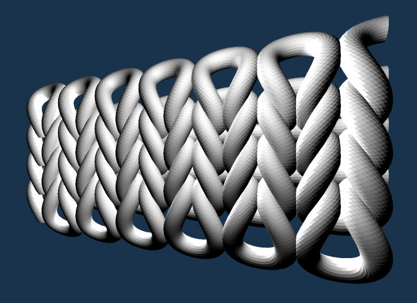
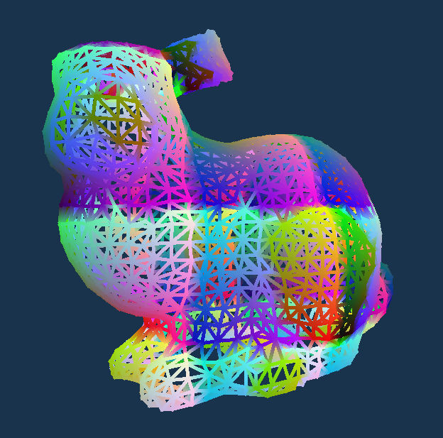

Playground for some lightweight WebGPU experiments.

# Yarn Generation

Demo: https://potree.org/permanent/webgpu_playground/yarn/

Implementation of <a href="https://twitter.com/keenanisalive/status/1640371889846771713" target="_blank">Keenan Crane's yarn function</a> in WebGPU. Uses a compute shader to generate the geometry each frame, and an indirect draw call to draw it.

# Thick Lines

Demo: https://potree.org/permanent/webgpu_playground/thick_lines/

Rendering an indexed triangle mesh as wireframe, thick-line wireframe, or quads. Through vertex-pulling, the vertex shader reinterprets the mesh as lines or quads without the need to modify the buffers.

